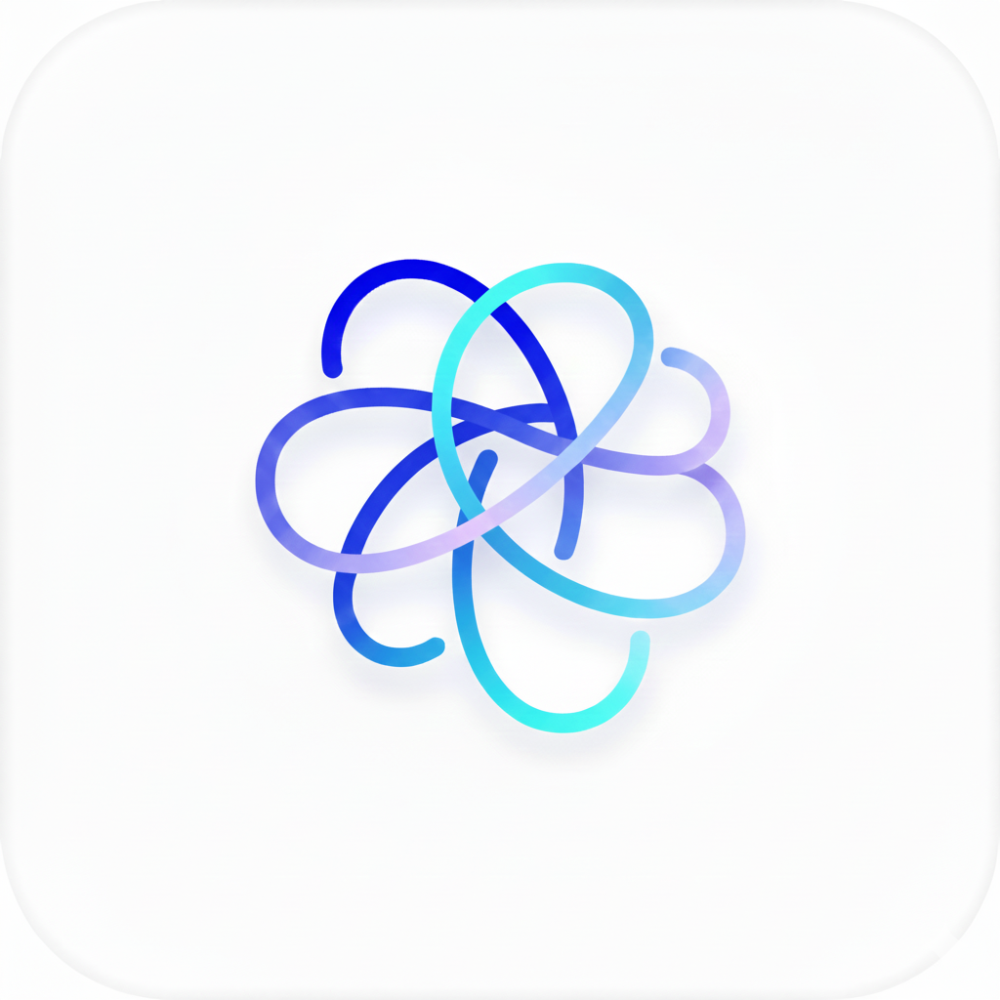

# ✨ Aura - AI Visual Planning Assistant

<p align="center">
  
</p>

<p align="center">
  <strong>Tu asistente de IA para planificación visual y organización personal</strong>
</p>

<p align="center">
  <a href="#características">Características</a> •
  <a href="#tecnologías">Tecnologías</a> •
  <a href="#instalación">Instalación</a> •
  <a href="#uso">Uso</a>
</p>

---

## 📱 Descripción

**Aura** es una aplicación móvil revolucionaria que transforma tu entorno en un espacio organizado utilizando inteligencia artificial avanzada. A diferencia de los asistentes tradicionales, Aura **ve** lo que tú ves.

Utilizando la potencia de **Google Gemini 2.0 Flash**, Aura ofrece una experiencia de "Live View" (Vista en Vivo) que analiza tu entorno en tiempo real, ofreciendo sugerencias, recetas y tareas de organización al instante. Simplemente apunta tu cámara y deja que Aura organice tu mundo.

## ⚡ Características Principales

### 👁️ Live View (Vista en Vivo)
La joya de la corona de Aura. Una interfaz de cámara aumentada que:
- **Analiza en tiempo real**: Comentarios instantáneos sobre lo que la cámara está viendo (estilo AR).
- **Modo Continuo**: Aura observa constantemente y te da feedback sin que tengas que pulsar nada.
- **Captura Inteligente**: Congela el momento para un análisis profundo.

### 🧠 Auto-Organización Inteligente
Aura no solo te dice qué hacer, lo hace por ti. Con el botón **"Agregar a Organización (Auto)"**:
1. Aura analiza la imagen capturada.
2. Determina automáticamente si es una **Tarea**, una **Receta** o un **Recordatorio**.
3. Extrae datos estructurados (ingredientes, pasos, fechas, prioridades) y los guarda en tu sistema de organización sin que escribas una sola palabra.

### 🤖 Chat Multimodal
- Conversación natural con contexto visual.
- Sube fotos de tu galería o usa las capturas recientes.
- Pide consejos de diseño, combinaciones de ropa o ayuda con tareas complejas.

### 📅 Centro de Comando
Un sistema de organización completo integrado con la IA:
- **Tareas**: Gestión de pendientes con prioridades.
- **Recetas**: Libro de cocina digital generado por IA a partir de fotos de ingredientes.
- **Recordatorios**: Alertas inteligentes.
- **Calendario**: Vista mensual de todos tus eventos.

## 🛠️ Tecnologías

Este proyecto es un showcase de tecnologías modernas de Flutter, IA y servicios en la nube:

### Core & Framework
- **Flutter 3.10+**: UI fluida y multiplataforma.
- **Dart 3**: Lenguaje robusto y tipado.

### Inteligencia Artificial
- **Google Gemini 2.0 Flash**: El modelo más rápido y eficiente de Google para visión y texto.
- `google_generative_ai`: Integración directa con la API de Gemini.

### Backend & Servicios en la Nube (Firebase)
- **Firebase Core**: Inicialización y configuración de servicios.
- **Firebase Auth**: Autenticación segura de usuarios.
- **Cloud Firestore**: Base de datos NoSQL en tiempo real para sincronizar tareas, recetas y eventos.

### Arquitectura & Estado
- **Provider**: Gestión de estado limpia y escalable.
- **MVC/Service Pattern**: Separación clara de lógica de negocio y UI.

### UI/UX
- **Glassmorphism**: Diseño moderno con efectos de desenfoque y transparencias.
- **Flutter Animate**: Animaciones declarativas para una experiencia premium.
- **Google Fonts**: Tipografía moderna y legible.
- **Flutter Markdown**: Renderizado de respuestas ricas de la IA.

### Hardware & Sistema
- **Camera**: Gestión avanzada de hardware de cámara para Live View.
- **Image Picker**: Selección de imágenes de la galería.
- **Flutter Local Notifications**: Sistema de notificaciones y recordatorios locales.
- **Path Provider**: Gestión de almacenamiento local.

## 📦 Estructura del Proyecto

```
lib/
├── main.dart                 # Entry point
├── screens/
│   ├── live_view_screen.dart # Core: Cámara AR y Auto-Organización
│   ├── home_screen.dart      # Dashboard y Chat
│   ├── organization_screen.dart # Gestión de tareas/recetas
│   └── ...
├── services/
│   ├── gemini_service.dart   # Cerebro de la IA (Prompt Engineering)
│   ├── camera_service.dart   # Abstracción de hardware
│   └── ...
├── providers/
│   ├── organization_provider.dart # Lógica de negocio para datos
│   └── ...
└── models/
    └── organization_models.dart # Estructuras de datos (Task, Recipe, etc.)
```

## 🚀 Instalación

1. **Clonar el repositorio**
```bash
git clone https://github.com/yesimaaar/Aura.git
cd Aura
```

2. **Instalar dependencias**
```bash
flutter pub get
```

3. **Configurar API Key**
Necesitas una API Key de [Google AI Studio](https://makersuite.google.com/app/apikey).

4. **Ejecutar**
```bash
flutter run --dart-define=GEMINI_API_KEY=tu_api_key_aqui
```

## 📖 Guía de Uso Rápido

1. **Modo Live**: Abre la cámara desde el home. Activa el switch "LIVE" para ver comentarios en tiempo real sobre tu entorno.
2. **Captura y Organiza**:
   - Apunta a un escritorio desordenado -> Toca el botón de captura -> "Agregar a Organización" -> Aura creará una **Tarea** de limpieza.
   - Apunta a unos ingredientes -> Toca captura -> "Agregar a Organización" -> Aura creará una **Receta** con pasos e ingredientes.
3. **Chat**: Usa el chat principal para preguntas de seguimiento sobre tus capturas.

---

<p align="center">
  Hecho con ❤️ por Yesimar
</p>
